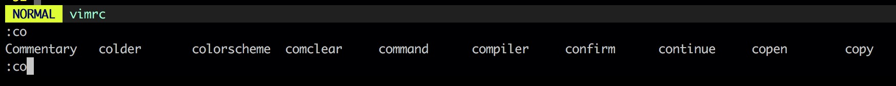

# Command Mode Cheeatsheets

主要记录 **命令模式** 中的按键。

## 范围([range])

在命令模式中，范围 (`[range]`) 用 `:{start},{end}` 这种形式来标示。

* `1` - 文件的第一行
* `.` - 当前行
* `$` - 最后一行
* `%` - 当前文件的所有行 - `1,$` 的简写形式
* `'<` - 高亮区域的起始行
* `'>` - 高亮区域的最后行
* `'<,'>` - 高亮选中时，使用 `:` 进入命令模式时自动输入到命令行中，用于表示高亮选中的区域

## `,` vs `;`

在 Vim 中，符号 `,` 和 `;` 都可以用来表示开始/结束范围的分割，但是存在一点区别：`,` 符号分割的范围中如果有相对范围的话，则是相对于光标所在的当前行来计算的；而 `;` 符合分割的范围中如果有相对范围的话，则是相对于另外一个开始/结束范围来计算的。例如光标当前在第 5 行的话：

```viml
:1,7delete "表示删除 1-7 行
:1,+2delete " 表示删除 1-7 行，+2 表示相对于当前行再向后 2 行，也就是第 7 行
:1;7delete " 同 1,7delete
:1;+2delete " 表示删除 1-3 行，+2 表示相对于范围开始的那行（即第1行）向后 2 行，也就是第 3 行
```

## 特殊符号([cmdline-special])

* `%` - 在命令行中非范围区域时，表示当前文件名; 其实 `%` 也是范围 `1,$` 的语法糖
* `!!` - 在普通模式中使用该命令时，会在命令行中出现 `:.!`，此时可以在其后输入一个外部 shell 命令，该命令的结果会被用来替换当前行

## 操作缓冲区文本的 Ex 命令

* `[range]print` - 打印 `[range]` 范围内的行, `print === p`
* `[range]copy {address}` - 复制 `[range]` 范围内的行到 `{address}` 指定的行之下，`:co` `:t` 与 `copy` 同义
* `[range]move {address}` - 移动 `[range]` 范围内的行到 `{address}` 指定的行之下，`:m` 与 `move` 同义
* `[range]normal {command}` - 对 `[range]` 范围内的行执行普通模式下的 `{command}` 命令
* `@:` - 重复执行上一次的 EX 命令

### `:[range]normal {command}` - 注释整个文件

`:normal` 命令可以对 `[range]` 指定的行执行普通命令 `{command}`，所以可以通过该命令批量注释：

```viml
:%normal I//   - % 标示所有行，I 标示插入到行首，// 为 JavaScript 注释符号
:%normal A;    - 同上，只不过这行的作用是在每行的最后添加分号
```

## 自动补全 Ex 命令

* `<Tab>` - 根据上下文自动补全 Ex 命令
* `<C-d>` - 显示可以补全的 Ex 命令列表

## 设置自动补全选择

### bash shell

第一种，bash shell 补全模式：

```viml
set wildmode=longest,list
```

效果如下：



### zsh

第二种，zsh 的自动补全菜单模式：

```viml
set wildmenu
set wildmode=full
```

效果如下：


这种模式可以通过 `<Tab>` `<C-n>` `Right` 正向遍历；也可以通过 `<S-Tab>` `<C-p>` `Left` 进行反向遍历。

## 命令行窗口

* `q:` - 打开 Ex 命令历史的命令行窗口
* `q/` - 打开查找命令历史的命令行窗口
* `<C-f>` - 从命令行模式切换到命令行窗口

**注意⚠️：在命令行窗口中，可以像普通模式一样编辑历史命令。**

## shell

* `:shell` -  调用一个新的 shell，输入 `exit` 返回 Vim
* `<C-z>` - 将当前的 Vim 进程放入后台运行
* `fg` - cmdline 命令，用于将放入后台的 Vim 放在前台执行
* `:!{cmd}` - 执行 shell 命令
* `:read !{cmd}` - 在 shell 中执行 {cmd} ，并把其标准输出插入到光标下方
* `:[range]write !{cmd}` - 在 shell 中执行 {cmd} ，以 [range] 作为其标准输入

## tab 操作

* `:tabnew` - 在当前 tab 之上生成一个新的 tab
* `:tabnext` - 切换到后面一个tab，如果当前 tab 是最后一个 tab 则切换到第一个 tab
* `:tabPrevious` - `:tabnext` 命令的反向操作
* `:exit` - 关闭当前 tab

## Author Info 🦈

* [Github](https://github.com/Tao-Quixote)
* Email: <web.taox@gmail.com>
