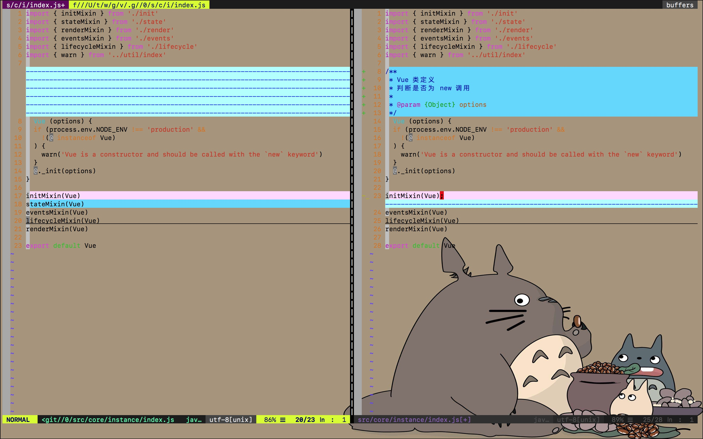
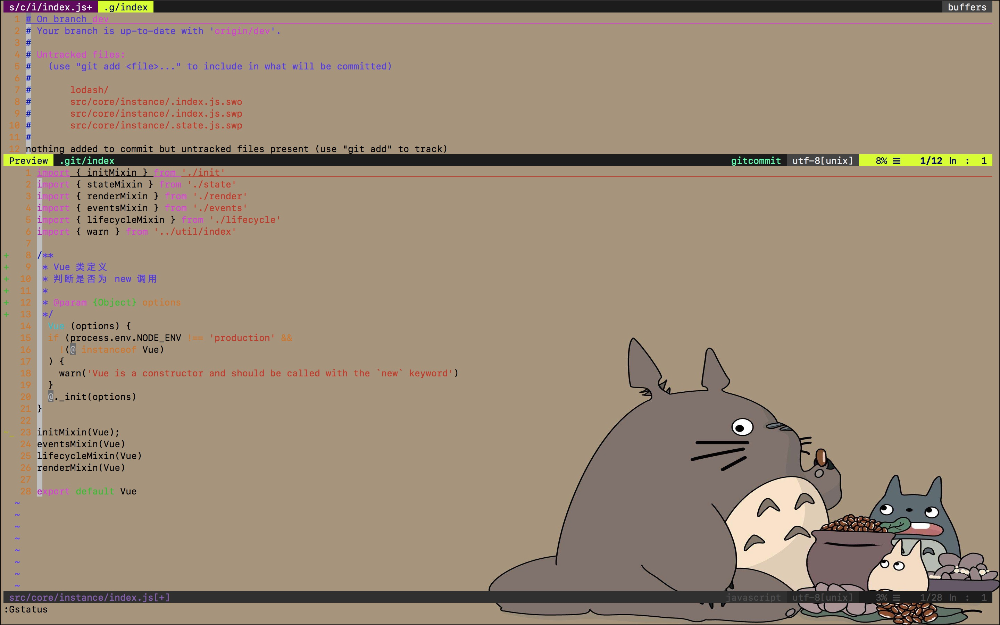
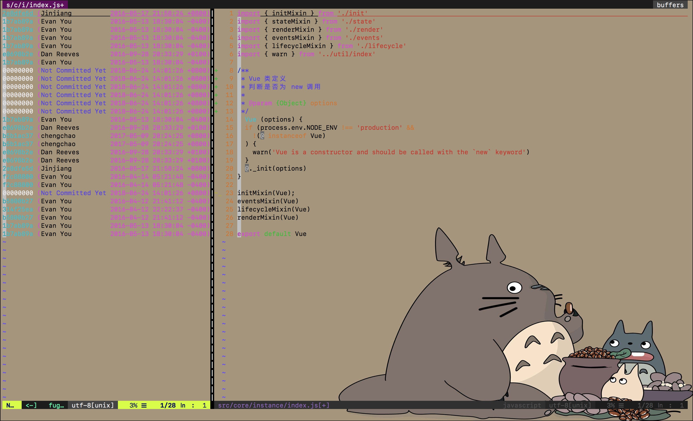

# fugitive.vim

在平常的开发中，我们经常会使用 **Git**, **SVN** 等版本管理(vcs)工具来管理代码的版本以及查看提交历史。当我们使用 Vim 进行开发时，也需要查看、提交等操作；而 Vim 本身并不支持 Git 等版本管理工具，所以今天介绍的这个插件，就是用来在 Vim 中使用 Git 工具的。

[fugitive.vim](https://github.com/tpope/vim-fugitive) 对 Git 进行了封装，使用 `G{command}` 的方式向外暴露封装后对命令，方便我们在普通模式中使用相关的命令执行 Git 相关的操作。

## 命令

### Gdiff

`Gdiff` 命令是对 `git diff` 的封装，当使用该命令时，会在当前文件的左边再打开一个新的窗口，逐行对比工作区和暂存区中每一行的差异，如下图：

### Gstatus

`Gstatus` 命令是对 `git status` 的封装，使用时，会在当前文件的上方打开新窗口展示修改过的文件的状态，如下图：

在 `Gstatus` 命令新打开的窗口中，可以使用 `-`/`p` 来操作修改过的文件；其中 `-` 会对修改过的文件执行 `add`/`reset` 的操作，而 `p` 会对修改过的文件执行 `add`/`reset` `--patch` 的操作。

### Gcommit

`Gcommit ` 命令是对 `git commit ` 的封装。

### Gblame

`Gblame ` 命令是对 `git blame ` 的封装，使用时，会在当前文件的左边打开新窗口展示当前文件每一行的最后提交者，如下图：

### Gmove

对 `git mv` 的封装，将当前文件从文件管理中移除。

### Gdelete

对 `git delete` 的封装，将当前文件从文件管理中移除并删除文件。

### Gbrowse

对 `git instaweb` 的封装，但是 fugitive.vim 插件自身不能完成该功能，需要 [vim-rhubarb](https://github.com/tpope/vim-rhubarb) 插件的配合。

安装好 [vim-rhubarb](https://github.com/tpope/vim-rhubarb) 插件之后，该命令可以将当前文件用浏览器打开。

## Repo

该插件的 [GitHub 地址](https://github.com/tpope/vim-fugitive)。

## Author 🦑

* [GitHub](https://github.com/Tao-Quixote)
* Email: <web.taox@gmail.com>