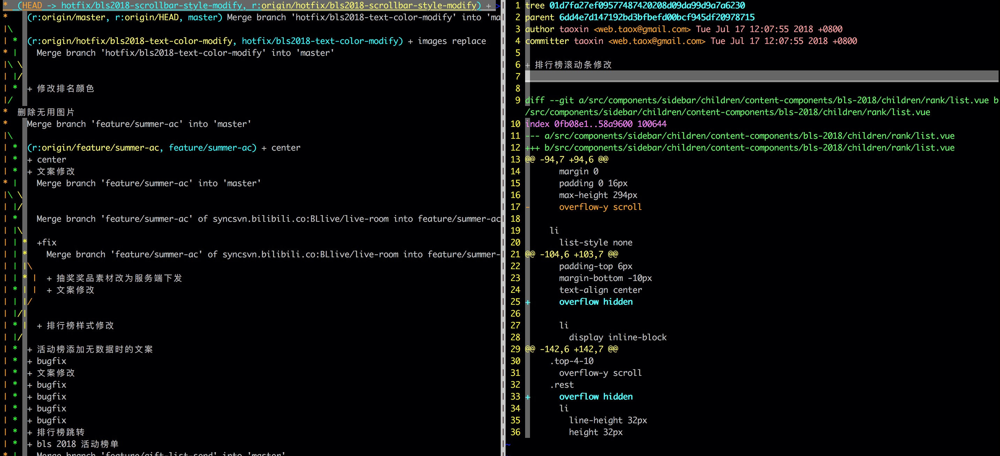
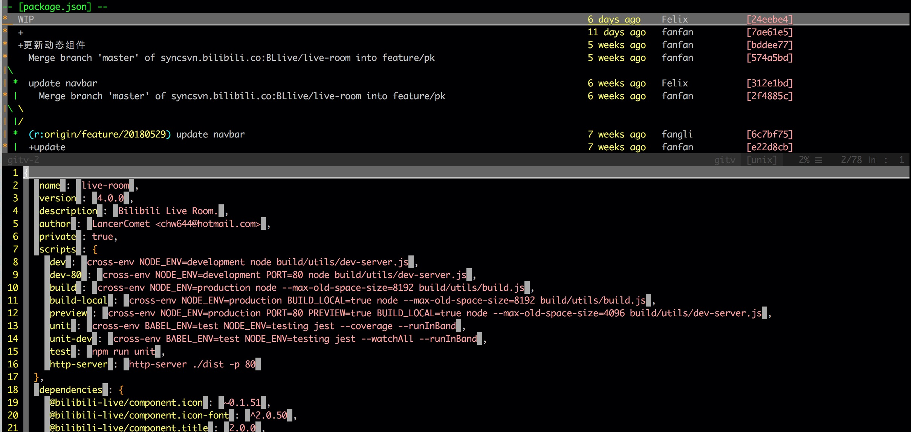

# gitv

今天要说的这个插件还是跟 Git 操作相关的插件。在之前，我们介绍过 Xuyuanp/nerdtree-git-plugin 插件，用在目录树中标示修改过的文件；也介绍过 vim-fugitive 插件，几乎涵盖了所有 Git 相关的操作，包含 status、add、delete、remove、blame、diff 等操作。vim-fugitive 也包含了 git log 操作，但是该插件提供的 log 功能比较单一，所以今天我们来介绍一个 log 功能比较强大的插件 - [gregsexton/gitv](https://github.com/gregsexton/gitv)。

## 安装

推荐使用 vim-plug 来管理插件。使用方法可以参考 [vim-plug](./vim-plug.md)。

## 模式

gitv 插件有两种模式：Browser mode 和 File mode，详情如下：

### Browser mode

Browser 模式会打开一个新的 tab，然后在 tab 中展示当前仓库的所有提交历史（包括 merge 历史），如果提交特别多，会展示一部分，需要的话可以加载更多提交历史；在光标所在的提交历史上点击回车，会在右侧的预览 tab 中展示这次提交的信息，其中包括每个文件修改了什么内容，如图：



在普通模式中使用 `:Gitv` 会触发该模式。

### File mode

File 模式会在当前文件之上打开一个预览窗口。File 模式与 Browser 模式的区别是该模式只会列出包含当前文件修改的提交，选中提交项时会展示修改内容。如图：



在普通模式中使用 `:Gitv!` 会触发该模式。

## 参数

其实 `:Gitv` 是对 `git log` 命令的封装，所以基本上 `git log` 接受的参数都可以作为 `:Gitv` 的参数，以便于更好的过滤提交。下面是几个比较常用的参数：

* `<since>..<until>` - 过滤展示 since 和 until 之间的提交；如果其中一个提交未写，则默认为 HEAD；
* `--merges` - 只展示 merge 提交；
* `-G<regex>` - 查找符合 `<regex>` 匹配项的删除/新增提交；

## key mappings

* `<cr>` - 回车键，展示提交的 header 信息和完整的 diff 内容
* J - 跳转到下一个提交并打开展示内容
* K - 同 J，不过跳转到上个提交
* o - 同 `<cr>`，不过会在新增的splilt 中展示
* O - 同 `<cr>`, 不过会在新的 tab 中展示
* s - 同 `<cr>`，不过会在新增的vsplilt 中展示
* q - 退出 gitv
* ...

太多了，不想一个一个写了，下面介绍如何在 vim 中查看插件的帮助文档：

在普通模式中，输入如下内容：

```viml
:h plugin-name-{options}
```

上面的 `{options}` 部分是可选的，如果只输入插件名字，vim 会打开该插件的帮助文档，并展示最开始的部分；如果填写了 `{options}` 部分，则会跳转到帮助文档的对应部分。在输入 `:h ` 之后，可以使用 tab 键提供的补全功能。

**注：每个插件的 `{options}` 部分都不完全相同，所以 A 插件有的 option B 插件中不一定存在。**

## GitHub Repo

[仓库地址](https://github.com/gregsexton/gitv)。

## Author 🦀

* [GitHub](https://github.com/Tao-Quixote)
* Email: <web.taox@gmail.com>
