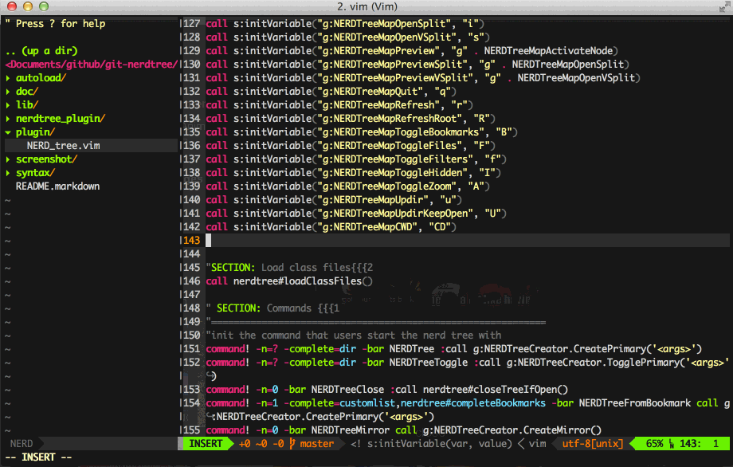

# nerdtree-git-plugin

平时开发的项目都是需要使用 Git 做版本管理的。今天介绍一个和 [NERDTree](https://github.com/scrooloose/nerdtree) 搭配使用的显示 Git 状态的 Vim 插件 -- **[nerdtree-git-plugin](https://github.com/Xuyuanp/nerdtree-git-plugin)**。

图示：



## 安装

建议使用 [vim-plug](./documents/vim-plug.md) 安装。

在 `.vimrc` 中添加：

```vim
Plug 'Xuyuanp/nerdtree-git-plugin'
```

然后使用 **vim-plug** 命令 `:PlugInstall` 一下就搞定了。

## 配置

> 自定义符号标识 git 状态

```vimscript
let g:NERDTreeIndicatorMapCustom = {
    \ "Modified"  : "✹",
    \ "Staged"    : "✚",
    \ "Untracked" : "✭",
    \ "Renamed"   : "➜",
    \ "Unmerged"  : "═",
    \ "Deleted"   : "✖",
    \ "Dirty"     : "✗",
    \ "Clean"     : "✔︎",
    \ 'Ignored'   : '☒',
    \ "Unknown"   : "?"
    \ }
```

> 如何显示 `ignored` 的文件状态？

```vimscript
let g:NERDTreeShowIgnoredStatus = 1
```
**注：很消耗性能，不建议开启。**

## 注意

1、只有在 Git 管理的项目的根目录打开时才能正常显示修改过的文件；如果是在项目中的其他目录（非根目录）打开，则可能并不会有修改标识；

2、只在目录树窗口中标识修改的文件，而不能在文件中标识修改的行。如果要在文件中标识修改过的行，请使用 [vim-gitgutter](./vim-gitgutter.md)。[issue](https://github.com/Xuyuanp/nerdtree-git-plugin/issues/89)。

# Author Info 🐝

* [GitHub](https://github.com/Tao-Quixote)
* Email: <web.taox@gmail.com>
