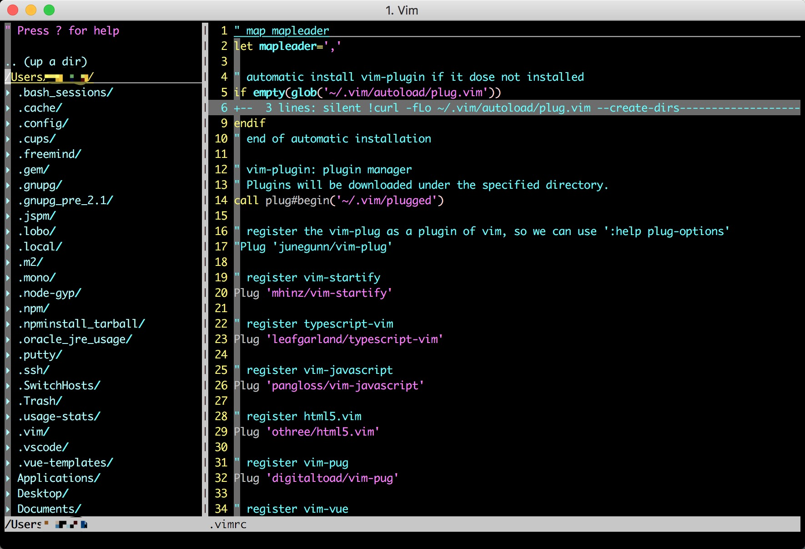

# NERDTree

平时使用 Vim 时，只能通过 `vim path/to/file` 这种方式打开文件；因为在做项目时经常需要在不同的目录之间跳转，每次都要通过输入相对/绝对地址的方式打开文件会非常不方便，所以这里介绍一款可以在 Vim 中创建目录的插件：NERDTree。

GitHub 仓库地址：[NERDTree](https://github.com/scrooloose/nerdtree)。

插件可以通过 **vim-plug** 来管理。

打开 NERDTree 时，效果如下图所示：



在使用 `:NERDTree` 命令打开目录窗口之后，该窗口中的所有操作跟在普通窗口中一致，例如上下左右移动，查找等。

## 常用命令

* `:NERDTree [<start-directory> | <bookmark>]`：根据传参打开一个新的目录窗口，如果没有传参，则将当前目录作为新目录窗口的根目录；
* `:NERDTreeClose`：关闭当前目录窗口；
* `:NERDTreeToggle`：切换目录窗口的打开/关闭状态；
* `:NERDTreeCWD`：将当前路径作为目录窗口的根目录；

### 自定义快捷键映射

NERDTree 的命令都比较长，所以在使用的时候完整地敲出来会很慢，所以这里建议大家定义属于自己的快捷键来作为命令的映射；下面是作者自己定义的映射，可以作为参考：

```vim
let mapleader=',' // 将 leader 映射为 `,` 键，默认为 `\` 键

" NERDTree settings

map <leader>g :NERDTreeToggle<CR> // 将 `,g` 作为 :NERDTreeToggle 命令的映射

" let nerdtree show hidden file
```

**注：在 .vimrc 中， `"` 为注释标识。**

其他的命令大家可以仿照上面的第三行来设置快捷键。作者这里只设置了一个 `:NERDTreeToggle` 命令，因为作者感觉 打开/关闭 目录窗口有一个快捷键就够了，快捷键的数量越少越好，所以就没有定义 `:NERDTreeClose` 等其他快捷键。

在设置快捷键的时候，建议设置为左右手各一个键的组合，因为这样的话在按快捷键的时候，避免了同一个手按两次，速度应该会更快一点。

## FAQ

> 是否支持 git 标识？

可以安装 [nerdtree-git-plug](https://github.com/Xuyuanp/nerdtree-git-plugin)，安装之后支持展示 git 标识。

> 如何在 vim 启动的同时启动 NERDTree？

在 Vim 的配置文件中加入如下配置：

```vim
autocmd vimenter * NERDTree
```

> 如果 Vim 在启动时未指定文件，如何自动打开 NERDTree？

在 Vim 的配置文件中加入如下配置：

```vim
autocmd StdinReadPre * let s:std_in=1
autocmd VimEnter * if argc() == 0 && !exists("s:std_in") | NERDTree | endif
```

> 如果 Vim 在启动时指定的为目录，如何实现自动打开 NERDTree？

在 Vim 的配置文件中加入如下配置：

```vim
autocmd StdinReadPre * let s:std_in=1
autocmd VimEnter * if argc() == 1 && isdirectory(argv()[0]) && !exists("s:std_in") | exe 'NERDTree' argv()[0] | wincmd p | ene | endif
```

> 如何修改默认的箭头(目录展开/关闭时的箭头)？

可以通过定义下面的变量来设置展开/关闭时的箭头，下面的为默认箭头：

```vim
let g:NERDTreeDirArrowExpandable = '▸'
let g:NERDTreeDirArrowCollapsible = '▾'
```

## 其他快捷键

以上是基本操作。下面来看一下 NERDTree 中定义的其他快捷键。以下快捷键只在 NERDTree 窗口中有效，所以虽然与 Vim 的其他快捷键可能有冲突，但是在 NERDTree 窗口中会被重新定义。

```vim
o.......打开文件、目录或者书签...............................|NERDTree-o|
go......打开选中的文件，但是焦点仍在 NERDTree 窗口中...........|NERDTree-go|
t.......在新 tab 标签页中打开选中的文件或者书签................|NERDTree-t|
T.......同 t，但是焦点停留在 NERDTree 窗口中.................|NERDTree-T|
i.......在分割（将 tab 分割为上下两部分）的窗口中打开选中的......|NERDTree-i|
gi......同 i, 但焦点保持不变................................|NERDTree-gi|
s.......在垂直分割的新 tab 中打开选中的文件...................|NERDTree-s|
gs......同 s，但是焦点保持不变..............................|NERDTree-gs|
O.......递归打开选中的目录及其自目录.........................|NERDTree-O|
x.......关闭当前节点的父节点................................|NERDTree-x|
X.......关闭当前节点的所有子节点及子节点的子节点...............|NERDTree-X|
e.......编辑当前目录......................................|NERDTree-e|

D.......删除当前选中的书签.................................|NERDTree-D|

P.......跳转到根节点...................|NERDTree-P|
p.......跳转到当前节点的父节点...........|NERDTree-p|
K.......在当前目录树中向上移动...........|NERDTree-K|
J.......在当前目录树中向下移动...........|NERDTree-J|
<C-J>...向下跳转到当前目录的兄弟目录节点...|NERDTree-C-J|
<C-K>...向上跳转到当前目录的兄弟目录节点...|NERDTree-C-K|

C.......将当前选中的目录作为目录树的根节点.........|NERDTree-C|
u.......将目录树的根节点上移一层.................|NERDTree-u|
U.......同 u，区别在于原来的目录树保持打开状态.....|NERDTree-U|
r.......递归刷新当前目录.......................|NERDTree-r|
R.......递归刷新当前根目录.....................|NERDTree-R|
m.......显示 NERD tree 菜单..................|NERDTree-m|
cd......将当前选中的目录作为 CWD...............|NERDTree-cd|
CD......将当前目录树的根节点作为 CWD............|NERDTree-CD|

I.......切换是否显示隐藏文件....................|NERDTree-I|
f.......切换是否使用文件过滤器..................|NERDTree-f|
F.......切换是否显示文件.......................|NERDTree-F|
B.......切换是否显示书签列表....................|NERDTree-B|

q.......关闭 NERDTree 窗口................................|NERDTree-q|
A.......缩放 NERDTree 窗口................................|NERDTree-A|
?.......切换帮助信息的打开/关闭状态..........................|NERDTree-?|
```

## Mmmm...

基本命令及设置就讲这么多，更高级的用法可以查看 [NERDTree.txt](https://github.com/scrooloose/nerdtree/blob/master/doc/NERDTree.txt)。

## Author 🦉

* [GitHub](https://github.com/Tao-Quixote)
* Email: <web.taox@gmail.com>