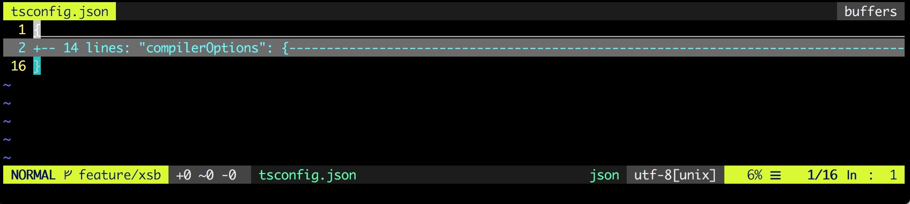
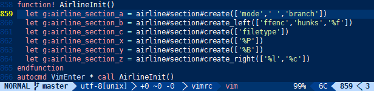

# vim-airline

**vim-airline** 插件用来在 tab 底部展示状态信息，也可以在顶部展示 buffer 信息。

截图如下：



底部状态信息从左向右依次为：Mode 信息、VCS 分支信息、hunks、文件名、文件类型、编码格式、光标在文件中的位置。

vim-airline 将状态信息分为如下几个部分：

```txt
+-----------------------------------------------------------------------------+
| A | B |                     C                            X | Y | Z |  [...] |
+-----------------------------------------------------------------------------+
```

其各个分区的含义如下：

| 分区 | 内容 |
| --- | ---|
| A | 展示 Vim 当前的模式 |
| B | VCS 信息，包括 分支、hunks 等 |
| C | 文件名 + 只读标识(RO) |
| X | 文件类型 |
| Y | 文件编码 |
| Z | 光标在文件中的位置 |
| [...] | 来自外部插件(e.g. YCM, syntastic...)的其他分区信息 |

**注：这是文档建议的分区方式，但是允许自定义配置。最上面的截图与分区含义并不完全一一对应，因为作者进行了自定义配置。**

## 需要其他插件的配合

vim-airline 并不是靠自己实现的所有功能，有很多信息都是其他插件提供的，vim-airline 的强大，正是源于其能与很多第三方插件无缝地结合。下面两个功能，需要与第三方插件合作：

### VCS 信息

状态条中展示的版本管理分支信息不是 air-line 自己实现的，而是依赖第三方插件 [vim-fugitive](https://github.com/tpope/vim-fugitive)。该插件对 Git 进行了包装，然后提供了很多版本管理相关功能。如果要在状态栏中展示版本管理相关的信息，请安装 vim-fugitive 插件之后重启 Vim 重试。

### hunks 信息

在状态栏的 B 分区部分，会展示当前 cursor 所在的代码块是否做了修改；如果有修改，则展示修改相关的信息。这部分信息也不是 vim-airline 提供的，而是 [vim-gitgutter](./vim-gitgutter.md) 提供的。如果需要查看 hunks 信息，请先安装 vim-gitgutter 插件。

## 自定义状态栏

vim-airline 的状态栏中各个分区的内容都可以自定义配置，官方仓库中有一张截图，可以参照该截图自定义配置各个分区要展示的信息：



可以只对需要的部分进行配置，其他分区如果不配置，则按照默认配置处理。作者的配置如下：

```vimscript
" customize the section
function! AirlineInit()
  " section a: mode & VCS info; VCS info is provided by vim-fugitive
  let g:airline_section_a = airline#section#create(['mode', ' ', 'branch'])
  " section b: hunks info, provided by vim-gitgutter
  let g:airline_section_b = airline#section#create(['hunks'])
endfunction

autocmd VimEnter * call AirlineInit()
```

## 性能优化

vim-airline 插件为了性能做了很多优化，但是有些有些默认的配置考虑到使用方便是默认打开的，但是会消耗更多的性能。所以针对这些默认配置，我们可以手动配置以减少性能、内存的消耗。

### extensions

vim-airline 默认会加载很多扩展来实现更强大的功能，但是其中很多功能可能我们并不需要，所以 vim-airline 提供了配置接口，允许我们只定义自己需要的扩展，实现按需加载：

```vimscript
" enable none extensions for opimization
:let g:airline_extensions = ['tabline', 'hunks', 'branch']
```

在 `.vimrc` 中配置之后，vim-airline 只会加载列出的扩展；如果是一个空数组的话，则不会加载任何扩展。

### caching

在 Vim 中调用语法高亮功能的性能开销是比较大的，而 vim-airline 支持缓存语法高亮，这样就避免了在 Vim 中多次调用语法高亮功能，从而减少性能的消耗。开启语法高亮缓存功能，可通过如下的配置实现：

```vimscript
" cache :hi calls for optimization
:let g:airline_highlighting_cache = 1
```

## 主题

vim-airline 提供了很多不同的主题，可以按照自己的喜好配置。在使用主题之前，需要安装插件 [vim-airline-theme](https://github.com/vim-airline/vim-airline-themes)。安装好之后，根据自己的喜好，在 `.vimrc` 中通过下面的配置使用自己喜欢的主题：

```vimscript
let g:ariline_theme='<theme>'
```

`<theme>` 为主题的名字。

# Author Info 🐌

* [GitHub](https://github.com/Tao-Quixote)
* Email: <web.taox@gmail.com>