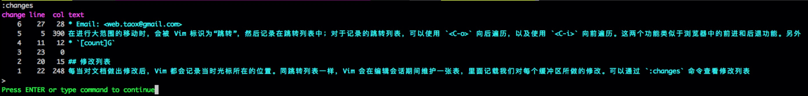

# 在文件之间跳转

## 跳转列表

在进行大范围的移动时，会被 Vim 标识为“跳转”，然后记录在跳转列表中；对于记录的跳转列表，可以使用 `<C-o>` 向后遍历，以及使用 `<C-i>` 向前遍历。这两个功能类似于浏览器中的前进和后退功能。另外，对于不同的窗口，Vim 会维护不同的跳转列表，所以不同窗口之间的跳转列表互不影响。

可以通过 `:jumps` 命令查看当前窗口的跳转列表。

小范围的移动并不会被记录在跳转列表中，例如 `hjklwe` 等；下面是一部分会被记录为跳转的跳转命令：

* `[count]G`
* `/pattern<CR>` `?pattern<CR>`
* `%` - 跳转到匹配的括号
* `(` `)` - 跳转到上一句/下一句的开头
* `{` `}` - 跳转到上一段/下一段的开头
* `H/M/L` - 跳转到屏幕最上方/中间/底部
* `gf` - 跳转到光标下的文件名
* `<C-]>` - 跳转到关键字的定义的位置

## 修改列表

每当对文档做出修改后，Vim 都会记录当时光标所在的位置。同跳转列表一样，Vim 会在编辑会话期间维护一张表，里面记载我们对每个缓冲区所做的修改。可以通过 `:changes` 命令查看修改列表:



倒数第二行的 `>` 标记了当前光标所在的修改列表的位置。

遍历修改列表使用 `g;` 和 `g,` 命令。

## `gf`

在 Vim 中，在编辑编程语言的文本时，可以通过 `gf` 命令跳转打开指定的文件。在有的语言中， 对于引用的文件，允许省略该类型文件的扩展名，因此，如果 Vim 没有默认支持该类型文件的话，可以通过下面的命令添加支持的扩展：

```viml
:set suffixesadd+=.rb
```

通过上面的配置，Vim 就会支持打开省略了扩展名的 Ruby 文件；其他开发语言同理。

Vim 在打开光标下的文件时，默认使用 `path` 中指定的目录进行查找，所以如果要扩大查找范围，可以通过下面的命令扩大查找范围：

```viml
:set path+=./node_modules
```

## 全局文件标记

Vim 允许通过 `m{mark}` 的形式设置标记，然后可以通过 \`\{mark\} 跳转到之前设置的标记位置；如果 mark 是小写字母的话，则只在当前缓冲区有效;而如果是大写字母的话，则视为标记在全局作用域中，可以跨文件跳转。

所以当我们想在一个文件中查找某个函数的定义时，可以先在当前文件设置一个全局作用域，然后执行查找命令跳转到定义的位置（可能在其他文件中）；查看完成后，可以通过 \`\{mark\} 跳转回来。

## Author 🐪

* [Github](https://github.com/Tao-Quixote)
* Email: <web.taox@gmail.com>
