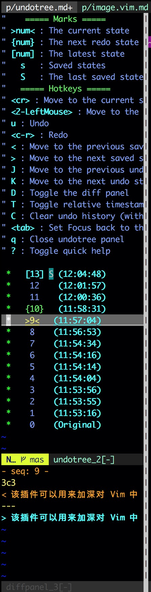
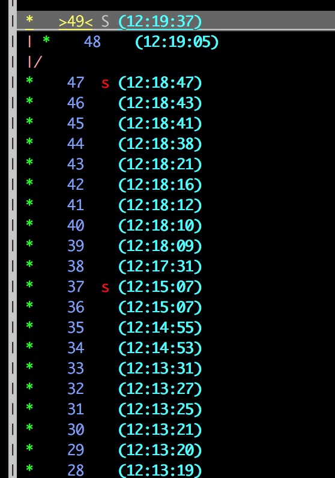

# undotree

该插件可以用来加深对 Vim 中 **Undo Branches** 特性的理解。也可以用来在多次内容变更之后用来找回之前的内容。不了解 Vim 中 **Undo Branches** 特性的可以跳转 [内容变更历史](../undo.md) 查看详细介绍。

## 管理

推荐使用 [vim-plug](./vim-plug.md) 来管理该插件。

## Features

* undo-tree 可视化
  * undo 历史基于变更时间戳排序，当天的变更不展示年/月/日
  * 变更序列号在时间戳之前展示
  * 当前位置通过 `>seq<` 标记
  * 下一个变更通过 `{seq}` 标记，载入下一次变更的命令：`:redo` `<c-r>`
  * 上一次变更通过 `[seq]` 标记，载入上一次变更的命令：`:undo` `u`
* 实时更新 diff 面板
* 高亮变更
* 通过单击/按键返回指定的变更
* 自定义热键和高亮
* 在 diff 面板展示变更

## screenshot

diff 面板截图：

## 快捷键

下面的快捷键只能在 undotree 的 diff 面板中使用。

* `u` - 撤销
* `<c-r>` - redo
* `<` - 跳转到上一次保存时的状态
* `>` - 跳转到下一次保存时的状态
* `J` - 跳转到上一次撤销时的状态
* `K` - 跳转到下一次撤销时的状态
* `D` - 切换 diff 面板
* `T` - 更新时间戳
* `C` - 清空变更历史
* `q` - 关闭 diff 面板
* `?` - 切换帮助

## 分支截图

在上面的 **Undo Branches** 图中，在第 47 次修改之后，增加了第 48 次修改，然后执行 undo，再增加第 49 次修改。从上图可以看出，每次执行 undo 然后再重新输入其他内容时，都会重新开启一个新的分支保存记录。其中，`>49<` 标识当前在 undo branches 中的位置；字号比较小的 `s` 表示之前保存过的位置，字号比较大的 `s` 标示最后一次保存的位置。

## 其他

可以通过 `:UndotreeToggle` 命令来切换是否展示 undotree 的面板，也可以通过 [按键映射](../map.md) 中介绍的方式定义适合自己的按键来执行 `:UndotreeToggle` 命令。

## Author Info 🕊 

* [Github](https://github.com/Tao-Quixote)
* Email: <web.taox@gmail.com>
