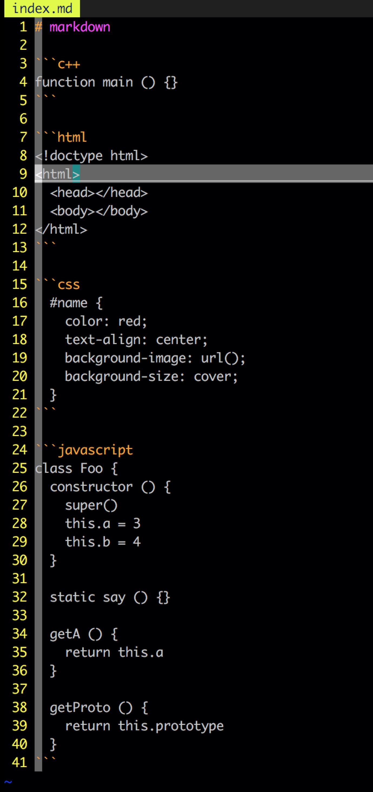

# vim-markdown

在日常的开发中，我们经常需要编写文档，且文档多为 markdown 文件；但是 **Vim** 原生并不支持 markdown 语法，所以使用 Vim 编辑 markdown 文件时，Vim 不会提供语法高亮功能。

今天要介绍的这个 Vim 插件就是用来提供 markdown 语法高亮功能的。

[vim-markdown](https://github.com/plasticboy/vim-markdown) Github 仓库地址。

以下是使用 vim-markdown 插件前后 markdown 文件的对比：




## 安装

推荐使用 [vim-plug](./vim-plug.md) 来管理该插件，详情请点击[vim-plug](./vim-plug.md)。

使用其他安装方式的小伙伴可以参考 [Installation](https://github.com/plasticboy/vim-markdown#installation)。

## 设置项

### 禁用折叠

```viml
let g:vim_markdown_folding_disabled=1
```

该设置项只用来控制 Markdown 相关的折叠控制，如果要设置 Vim 的标准折叠，请实用如下配置：

```viml
set [no]foldenable
```

### 禁用默认按键映射

```viml
let g:vim_markdown_no_default_key_mappings = 1
```

### Syntax Concealing

一些语法隐藏是默认开启的，比如 `[link text](link url)` 会只显示为 `link text`。开启 Vim 的标准隐藏配置使用下面的配置：

```viml
set conceallevel = 2
```

如果要在 markdown 文件中忽略 `conceallevel` 的设置，可以在 `.vimrc` 文件中添加如下配置：

```viml
let g:vim_markdown_conceal=0
```
推荐在 markdown 文件中使用上面的配置来禁用语法隐藏，因为如果不禁用 Vim 的标准隐藏，在代码块之前设置的代码块名称部分会被隐藏起来，看着会很不舒服；所以推荐大家在使用 vim-markdown 插件时使用上面的配置屏蔽默认隐藏。

### 设置代码块语言

在 markdown 中可以通过 \`\`\` \`\`\` 的方式来书写代码块，并且可以通过在其中书写文件类型名的方式来声明代码块中的语言类型。且 vim-markdown 提供了根据文件类型高亮代码的功能，且允许通过别名的方式来给文件类型命名别名：

```viml
let g:vim_markdown_fenced_languages = ['csharp=cs']
```

上面将 `csharp` 设置为了 `cs` 的别名，所以下面的代码块将会高亮以 `cs` 文件语法书写的部分：

```csharp
...
```

默认别名：['c++=cpp', 'viml=vim', 'bash=sh', 'ini=dosini']

### 语法扩展

下面的选项用来控制一些语法是否高亮，这些选项默认是关闭的，即不会高亮：

#### LaTeX math

```viml
let g:vim_markdown_math = 1
```

#### YAML

该语法多用于 Jekyll 或者 Hugo

```viml
let g:vim_markdown_frontmatter = 1
```

#### TOML

该语法用于 Hugo 中；该语法的高亮依赖 [vim-toml](https://github.com/cespare/vim-toml)

```viml
let g:vim_markdown_toml_frontmatter = 1
```

#### JSON

该格式文件的高亮依赖 [vim-json](https://github.com/elzr/vim-json)

```viml
let g:vim_markdown_json_frontmatter = 1
```

### 调整新列表项的缩进

如果插入了如下一行新内容：

```markdown
* item1
```

此时，如果你使用 `o` 来插入新的一行并且输入 `* item2` 是，结果如下：

```markdown
* item1
  * item2
```

vim-markdown 会自动插入缩进。默认情况下，缩进的空格数为 4；如果想要修改缩进的空格数，可以使用如下配置：

```viml
let g:vim_markdown_list_item_indent = 2
```

## 快捷键

* `gx`: 在浏览器中打开光标所在处的链接
* `ge`: 在 Vim 中打开光标下的链接指向的文件。主要用于打开使用相对位置标识的 markdown 文件
* `]]`: 跳转到下一个 header
* `[[`: 跳转到之前的 header，与 `]c` 相反
* `][`: 跳转到下一个兄弟 header
* `[]`: 跳转到上一个兄弟 header
* `]c`: 跳转到当前文本所属的 header
* `]u`: 跳转到"父"header

## 命令

* `:HeaderDecrease`: 减小当前 header 的等级，如 h2 => h1, h3 => h2
* `:HeaderIncrease`: 增大当前 header 的等级

这里只介绍常用的功能，更多功能请移步[官方仓库](https://github.com/plasticboy/vim-markdown#installation)。

## Author 🦀

* [GitHub](https://github.com/Tao-Quixote)
* Email: <web.taox@gmail.com>
